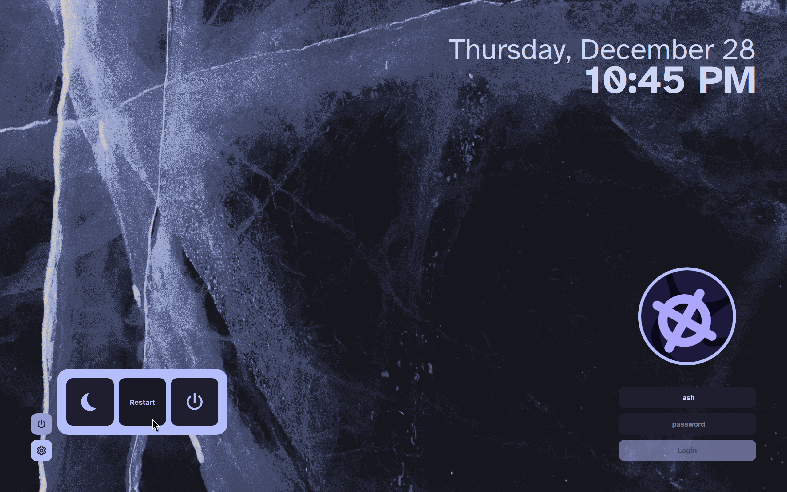
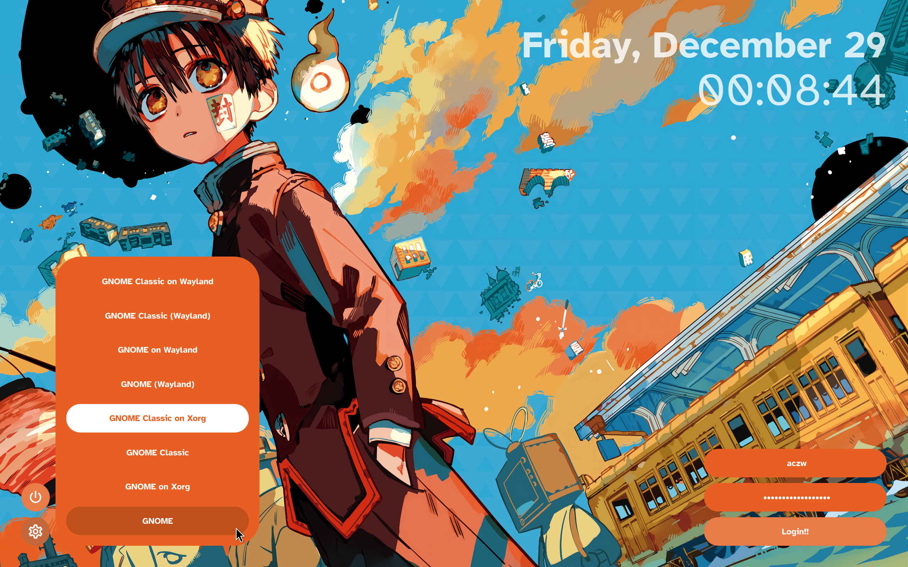
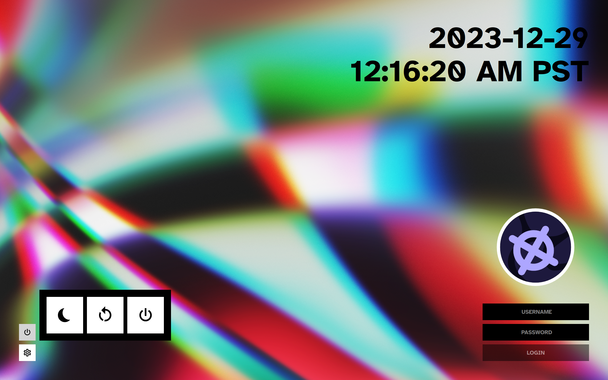
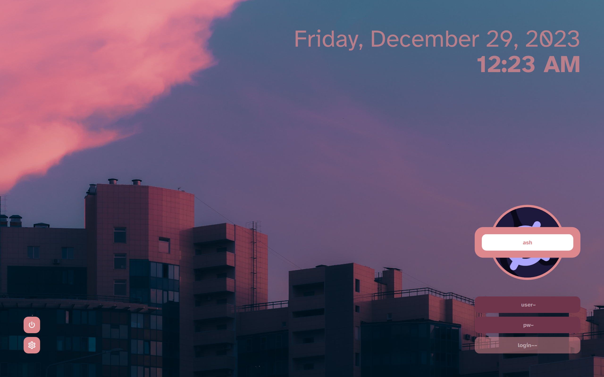

# corners

A very customizable [SDDM](https://github.com/sddm/sddm) theme that places controls on your screen corners.

</img>
</img>
</img>
</img>

I couldn't really find a preexisting theme that I liked, so I made my own. Layout inspired by [sddm-chinese-painting-theme](https://github.com/fralonra/sddm-chinese-painting-theme).

## Dependencies

This theme does not require KDE Plasma, so make sure you have Qt 5 installed!

- SDDM
- Qt 5
- Qt Graphical Effects
- Qt SVG
- Qt Quick Controls 2

On Arch, run

```sh
pacman -Syu sddm qt5-graphicaleffects qt5-svg qt5-quickcontrols2
```

## Installation

### From the AUR

For Arch users, the theme is available from the AUR [here](https://aur.archlinux.org/packages/sddm-theme-corners-git). Install it with your favorite AUR helper:

```sh
paru sddm-theme-corners-git
```

### Manually

On other distros, download/clone this repo, and copy the `corners/` folder to `/usr/share/sddm/themes/`.

```sh
git clone https://github.com/aczw/sddm-theme-corners.git
cd sddm-theme-corners/
sudo cp -r corners/ /usr/share/sddm/themes/
```

## Configuration

Figured people would want to tinker on their own, so font, colors, size, corner radius, and more can all be configured. Please see [CONFIG.md](CONFIG.md) for a description of what each option does!

If you haven't already, make sure to change the current theme that SDDM is using. On Arch, create a `.conf` file in `/etc/sddm.conf.d/` with the following contents:

```conf
[Theme]
Current=corners
```

Check the [Arch Wiki](https://wiki.archlinux.org/title/SDDM#Configuration) for more info.

You'll definitely want to configure the theme before using it. Out of the box it uses [Atkinson Hyperlegible](https://fonts.google.com/specimen/Atkinson+Hyperlegible) for the font and assumes a screen DPI of 216 (basically, my setup).

Edit `theme.conf` (inside `corners/`) as you see fit. I tried making most stuff customizable, but lemme know if you want more options.

## License

This project is licensed under GPLv3. Check it out [here](LICENSE).

## Thanks!

That's pretty much it :) I hope you enjoy the theme. Feedback is much appreciated!!
