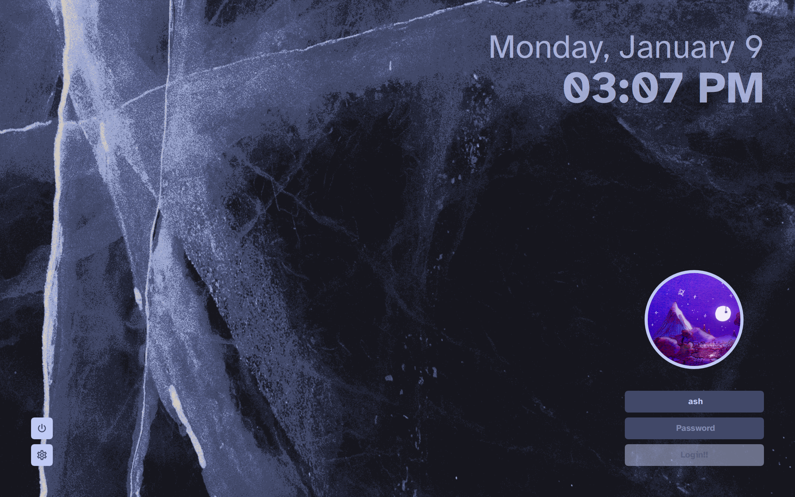
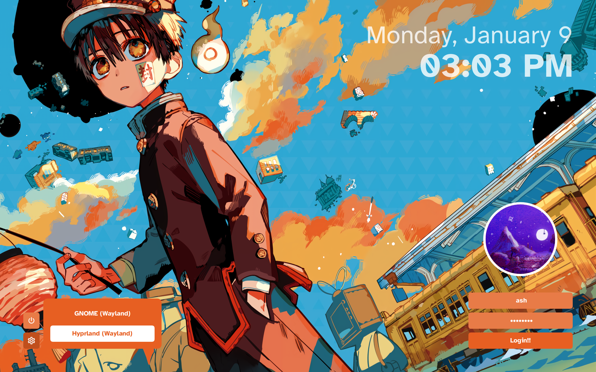

# corners

[SDDM](https://github.com/sddm/sddm) theme that places UI elements on the corners of your screen. take a look!




couldn't really find a theme that I liked, so I made my own. took some inspiration from [sddm-chinese-painting-theme](https://github.com/fralonra/sddm-chinese-painting-theme).

## dependencies

this theme does not require KDE Plasma, so make sure you have Qt 5 installed!

- SDDM
- Qt Graphical Effects
- Qt SVG
- Qt Quick Controls 2

on Arch, run `pacman -Syu sddm qt5-graphicaleffects qt5-svg qt5-quickcontrols2`

## installation

### AUR

for Arch users, the theme is available from the AUR [here](https://aur.archlinux.org/packages/sddm-theme-corners-git). install it with your favorite AUR helper: `paru sddm-theme-corners-git`

### manually

on other distros, download/clone this repo, and copy the `corners/` folder to `/usr/share/sddm/themes/`.

```
cd /usr/share/sddm/themes/
sudo git clone https://github.com/aczw/sddm-theme-corners.git
```

## configuration
please see [CONFIG.md](CONFIG.md) for a short description of what each option does!

if you haven't already, make sure to change the current theme that SDDM is using. on Arch, create a config file in `/etc/sddm.conf.d/` with the following contents:

```
[Theme]
Current=corners
```

check the [Arch Wiki](https://wiki.archlinux.org/title/SDDM#Configuration) for more info.

you'll probably want to configure the theme before using it. out of the box it uses [Atkinson Hyperlegible](https://fonts.google.com/specimen/Atkinson+Hyperlegible) for the font and assumes a screen DPI of 216 (basically, my setup).

edit `theme.conf` file (inside `corners/` folder) as you see fit. I tried making most stuff customizable, but lemme know if you want more options.

## license

this project is licensed under GPLv3. check it out [here](LICENSE).

## thanks!

that's pretty much it :) I hope you enjoy the theme. feedback is much appreciated!!
